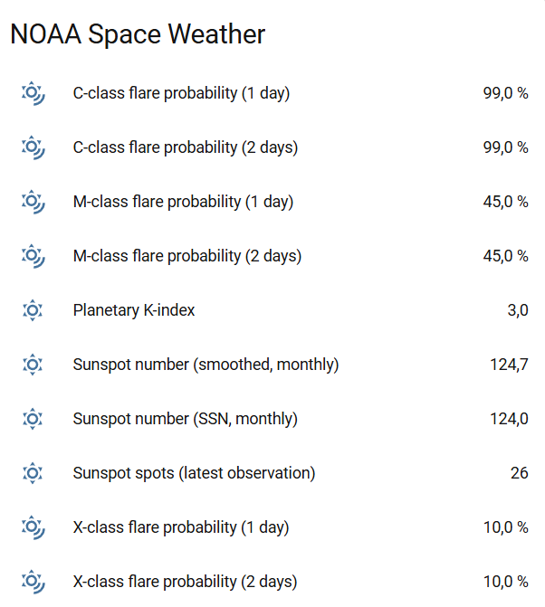
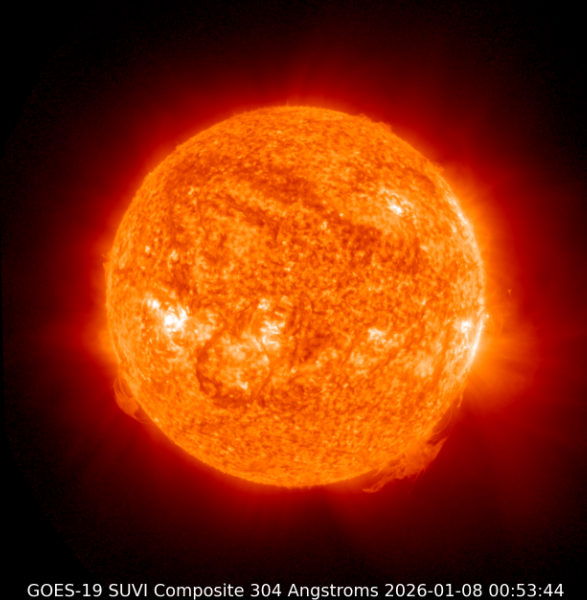

# NOAA Space Weather (Home Assistant)

[](https://github.com/anderl78/home-assistant_noaa-space-weather/releases)
[](https://github.com/anderl78/home-assistant_noaa-space-weather/commits)
[](LICENSE)

**Current maintainer:**  
- [@anderl78](https://github.com/anderl78)

**Original author / project initiator:**  
- [@tcarwash](https://github.com/tcarwash)

A **custom (non-official)** Home Assistant integration for data from the  
**NOAA Space Weather Prediction Center (SWPC)**.

>  **Disclaimer**  
> This integration is **not affiliated with NOAA**.  
> All data and images are fetched from publicly available NOAA SWPC endpoints.

---


##  Sensors

This integration exposes multiple sensors based on NOAA SWPC data, including:

- **Solar flare probabilities**
  - C-Class, M-Class, X-Class (1–2 day outlook)
- **Geomagnetic activity**
  - Planetary K-Index (1-minute resolution)
- **Sunspot data**
  - **International Sunspot Number (SSN)** (monthly)
  - Smoothed SSN (monthly trend)
  - Spot count from the latest sunspot observations
  - 


---

##  Animated Solar Images (SUVI)

The integration also provides **animated solar images** based on  
NOAA **SUVI (Solar Ultraviolet Imager)** data.

NOAA no longer publishes animated GIFs.  
Animations are therefore generated **client-side** by cycling through the latest PNG frames.

### Available wavelengths / layers
- `094 Å`
- `131 Å`
- `171 Å`
- `195 Å`
- `284 Å`
- `304 Å`
- `map`

Each wavelength is available as:
- **primary** (main optical path)
- **secondary** (backup optical path)

Example entity IDs:
```text
image.noaasw_animated_suvi_primary_304_angstroms
image.noaasw_animated_suvi_primary_171_angstroms
image.noaasw_animated_suvi_secondary_284_angstroms
```


---

##  Installation (Manual)

>  This integration is currently **not distributed via HACS**.

1. Open your Home Assistant configuration directory.
2. Create the folder (if it does not exist):
   ```
   custom_components/noaa_space_weather
   ```
3. Copy **all files** from this repository’s  
   `custom_components/noaa_space_weather/` directory into it.
4. Restart Home Assistant.
5. Go to **Settings → Devices & Services → Integrations**
6. Click **Add integration** and search for **NOAA Space Weather**

---

##  Configuration

- Configuration is done **entirely via the Home Assistant**
- No YAML configuration required
- All entities are created automatically

---

##  Example Lovelace Card

```yaml
type: vertical-stack
cards:
  - type: picture
    image_entity: image.noaa_space_weather_suvi_primary_304_animated
  - type: picture
    image_entity: image.noaa_space_weather_suvi_primary_171_animated
  - type: picture
    image_entity: image.noaa_space_weather_suvi_primary_284_animate
```

##  Compatibility

- Home Assistant **2025.12+**

---

##  Contributions

Contributions, bug reports, and suggestions are welcome.

Please use the issue tracker of this repository:  
https://github.com/anderl78/home-assistant_noaa-space-weather/issues

---

##  Credits & History

This integration was **originally created and published** by  
**[@tcarwash](https://github.com/tcarwash)**.

The original project was generated using:
- **[@oncleben31](https://github.com/oncleben31)’s**  
  Home Assistant Custom Component Cookiecutter
- Code patterns and structure inspired by  
  **[@Ludeeus](https://github.com/ludeeus)** and the  
  Home Assistant Integration Blueprint

This fork, maintained by **[@anderl78](https://github.com/anderl78)**, with:
- updated NOAA endpoints
- updated Home Assistant architecture
- additional sensors
- animated SUVI image support

All prior authors and contributors are gratefully acknowledged.

---

##  License

This project is licensed under the **MIT License**.  
See the [LICENSE](LICENSE) file for details.
